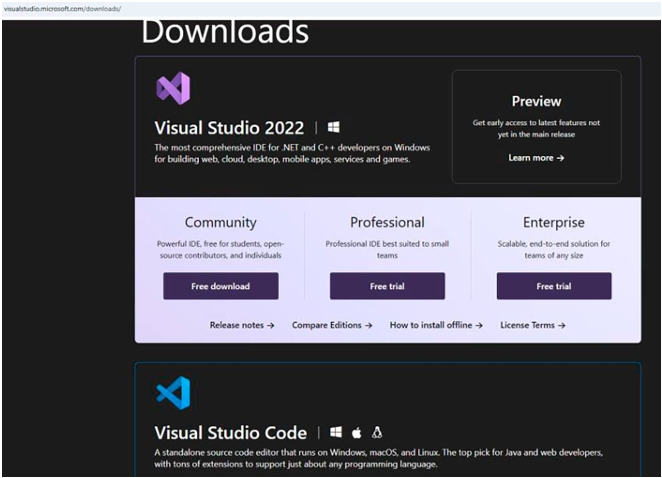

# مقدمه

با در دسترس بودن کامپیوترهای چند‌هسته‌ای (Multicore Computers)، برنامه‌نویسی ناهمگام (Asynchronous Programming) و برنامه‌نویسی موازی (Parallel Programming) اهمیت روزافزونی پیدا کرده‌اند. چرا که نه؟ این موضوع برای ساخت نرم‌افزاری با پاسخ‌گویی بالا کاملاً ضروری است. ⚡💻

به همین دلیل کار کردن با Threadها در یک محیط چندریسمانی (Multithreaded Environment) اجتناب‌ناپذیر است. بدون شک سخت است، اما در گذشته سخت‌تر بود. برای ساده‌تر کردن تجربه کدنویسی، مایکروسافت از نسخه‌ی .NET Framework 4.0، کتابخانه‌ای به نام Task Parallel Library (TPL) معرفی کرد که بر پایه‌ی مفهوم Task بنا شده بود.

بعدها، در C# 5 شاهد معرفی انقلابی دو کلمه‌ی کلیدی async و await بودیم. با استفاده از آن‌ها، شروع کردیم به سپردن کارهای سنگین به کامپایلر. با این حال باید به خاطر داشته باشید که یک متد معمولی async معمولاً یک Task برمی‌گرداند (در اصطلاح برنامه‌نویسی، Task یا Task<TResult>). بنابراین جای تعجب نیست که برنامه‌نویسی مبتنی بر Task به زیربنای مدرن برنامه‌نویسی ناهمگام تبدیل شده است.

علاوه بر این، الگوهایی که پیش‌تر برای مدیریت برنامه‌نویسی ناهمگام و موازی استفاده می‌شدند، امروزه دیگر توصیه نمی‌شوند.

به همین دلیل من تصمیم گرفتم یک مجموعه کتابچه‌ی کوچک درباره‌ی برنامه‌نویسی ناهمگام و موازی بنویسم. این مجموعه تلاش می‌کند با بهره‌گیری از ویژگی‌ها و کتابخانه‌های مدرن C# که توسط مایکروسافت توصیه شده‌اند، مفاهیم را ساده‌تر کند.

کتاب Task Programming in C# and .NET: Modern Day Foundation for Asynchronous Programming اولین کتاب از این مجموعه است. این کتاب روی برنامه‌نویسی مبتنی بر Task تمرکز دارد، بدون استفاده از کلمات کلیدی async و await. 📘✨

## کتاب چگونه سازمان‌دهی شده است؟ 💹

این کتاب به شما کمک می‌کند تا برنامه‌نویسی مبتنی بر Task را در قالب شش فصل و همراه با تعداد زیادی جلسات پرسش‌وپاسخ (Q&A Sessions) و تمرین‌ها یاد بگیرید. برای اینکه دید روشنی از ساختار فصل‌ها و محتوای کتاب پیدا کنید، در ادامه خلاصه‌ای از نکات آورده شده است:

- فصل ۱: برنامه‌نویسی ناهمگام (Asynchronous Programming) را با سناریوهای مفید معرفی می‌کند. همچنین یک مرور کلی از Task Parallel Library (TPL) ارائه داده و درباره‌ی Taskها بحث می‌کند. این فصل پایه و اساس فصل‌های بعدی است.

- فصل ۲: درباره‌ی ایجاد و اجرای Taskها صحبت می‌کند. وقتی یک Task را اجرا کردید، به احتمال زیاد دوست دارید نتیجه‌ی اجرای آن را ببینید. این یعنی باید منتظر بمانید تا Task اجرای خود را به پایان برساند. پیاده‌سازی یک مکانیزم درست برای انتظار (Waiting Mechanism) در محیط چندریسمانی (Multithreaded Environment) بسیار مهم است. این فصل همچنین انواع مختلف مکانیزم‌های انتظار را بررسی می‌کند.

- فصل ۳: به سناریوهای ادامه‌ی Task (Task Continuation Scenarios) می‌پردازد و همچنین درباره‌ی Taskهای تو در تو (Nested Tasks) بحث می‌کند.

- فصل ۴: مدیریت استثناها (Exception Handling) بخش ضروری برنامه‌نویسی است. این فصل این موضوع را پوشش داده و روش‌های مختلف مکانیزم‌های مدیریت استثنا را در برنامه‌نویسی مبتنی بر Task نشان می‌دهد.

- فصل ۵: معمولاً ما دوست نداریم برای Taskهای طولانی‌مدت بیش از حد صبر کنیم. همچنین، اگر یک خطا را زود تشخیص دهیم، ممکن است اجرای Taskها را ادامه ندهیم. بنابراین لغو Taskها (Task Cancellations) نیز هنگام کار با Taskها امری رایج است. این فصل به این موضوع اختصاص دارد.

- فصل ۶: شامل مطالب اضافی است که در فصل‌های قبلی مورد بحث قرار نگرفته‌اند.

- شما می‌توانید از یادگیری لذت ببرید وقتی که مطالعات موردی (Case Studies) را تحلیل می‌کنید، پرسش‌هایی (برای رفع ابهام‌ها) می‌پرسید و تمرین‌ها را انجام می‌دهید. بنابراین، در سراسر این کتاب بخش‌هایی از کدهای برنامه، جلسات پرسش‌وپاسخ (Q&A Sessions) و تمرین‌ها وجود دارد. با تحلیل این پرسش‌وپاسخ‌ها و انجام تمرین‌ها، می‌توانید پیشرفت خود را بررسی کنید. همان‌طور که پیش‌تر گفته شد، این موارد برای آسان‌تر و لذت‌بخش‌تر کردن یادگیری آینده‌ی شما طراحی شده‌اند و از همه مهم‌تر، باعث می‌شوند که به‌عنوان یک توسعه‌دهنده اعتمادبه‌نفس بیشتری پیدا کنید. 🚀👨‍💻

- هر پرسش در جلسات Q&A با قالب <شماره‌فصل>.<شماره‌سؤال> مشخص می‌شود. برای مثال: Q2.1 یعنی سؤال شماره‌ی ۱ از فصل ۲. در پایان هر فصل نیز تمرین‌هایی وجود دارند. می‌توانید از آن‌ها برای ارزیابی پیشرفت خود استفاده کنید. هر پرسش تمرینی با قالب E<شماره‌فصل>.<شماره‌سؤال> مشخص می‌شود. برای مثال: E5.3 یعنی تمرین شماره‌ی ۳ از فصل ۵.

- شما می‌توانید تمام کدهای منبع (Source Codes) این کتاب را از وب‌سایت ناشر دانلود کنید:
  
https://github.com/Apress/Task-Programming-in-C-and-.NET

## دانش پیش‌نیاز ✔️

من انتظار دارم شما با زبان C# به‌خوبی آشنا باشید. در واقع، دانستن برخی مفاهیم پیشرفته مثل Delegateها و Lambda Expressionها می‌تواند روند یادگیری شما را سریع‌تر کند. ⚡📘

من فرض می‌کنم که شما می‌دانید چگونه یک برنامه‌ی C# را در Visual Studio کامپایل یا اجرا کنید. این کتاب زمانی را صرف موضوعات ساده و دم‌دستی نمی‌کند؛ موضوعاتی مثل اینکه چطور Visual Studio را روی سیستم نصب کنید یا چگونه یک برنامه‌ی ساده‌ی "Hello World" در C# بنویسید. 🖥️

به طور خلاصه، مخاطبان هدف این کتاب کسانی هستند که می‌خواهند بیشترین بهره را از C# ببرند، با استفاده از قدرت ترکیبی برنامه‌نویسی شیءگرا (Object-Oriented Programming - OOP) و برنامه‌نویسی تابعی (Functional Programming - FP). 🚀

## این کتاب برای چه کسانی است؟ 🧐

می‌توانید این کتاب را انتخاب کنید اگر پاسخ شما به پرسش‌های زیر "بله" است:

+ آیا با .NET، زبان C# و مفاهیم پایه‌ای شیءگرایی مثل Polymorphism (چندریختی)، Inheritance (وراثت)، Abstraction (انتزاع) و Encapsulation (کپسوله‌سازی) آشنا هستید؟ 📘🔑

+ آیا با برخی مفاهیم پیشرفته در C# مانند Delegateها، Lambda Expressionها و Genericها آشنایی دارید؟ ⚡

+ آیا می‌دانید چگونه محیط کدنویسی (Coding Environment) خود را راه‌اندازی کنید؟ 🖥️

+ آیا علاقه‌مندید بدانید که ساختارهای مدرن زبان C# چگونه می‌توانند به شما در برنامه‌نویسی ناهمگام (Asynchronous Programming) و برنامه‌نویسی موازی (Parallel Programming) کمک کنند؟ 🚀

احتمالاً نباید این کتاب را انتخاب کنید اگر پاسخ شما به هر یک از پرسش‌های زیر "بله" است:

+ آیا به دنبال یک آموزش مقدماتی C# یا یک کتاب مرجع C# هستید؟ 📚

+ آیا آماده‌ی آزمایش و تجربه‌ی برنامه‌نویسی ناهمگام با استفاده از C# و .NET نیستید؟ ⚠️

+ «من ویندوز، Visual Studio و/یا .NET را دوست ندارم. می‌خواهم برنامه‌نویسی ناهمگام و موازی را بدون آن‌ها یاد بگیرم.» آیا این جمله در مورد شما درست است؟ ❌

##  نرم‌افزارهای مفید 💻🛠️

این‌ها نرم‌افزارها و ابزارهای مهمی هستند که من برای نگارش این کتاب استفاده کرده‌ام:

+ تمام برنامه‌ها با C# 13 و .NET 9 تست شده‌اند. ⚡📘
بد نیست بدانید که امروزه نسخه‌ی زبان C# به‌صورت خودکار بر اساس Target Framework پروژه‌ی شما انتخاب می‌شود، بنابراین همیشه بالاترین نسخه‌ی سازگار به‌طور پیش‌فرض در دسترس است.
در نسخه‌های جدید Visual Studio رابط کاربری برای تغییر این مقدار وجود ندارد، اما می‌توانید آن را با ویرایش فایل csproj. تغییر دهید.
اگر به موضوع نسخه‌بندی زبان C# علاقه دارید، می‌توانید از این لینک دیدن کنید:

 🌐https://docs.microsoft.com/en-us/dotnet/csharp/language-reference/configure-language-version.

+ در طول توسعه‌ی این کتاب، به‌روزرسانی‌های نرم‌افزاری منتشر می‌شد و من نیز همواره آن‌ها را نصب می‌کردم. وقتی پیش‌نویس اولیه را تمام کردم، از نسخه‌ی Microsoft Visual Studio Community 2022 (64-bit) – Preview Version 17.12.0 Preview 3.0 استفاده می‌کردم. اما هنگام تحویل نسخه‌ی نهایی، نسخه‌ی من Microsoft Visual Studio Community 2022 (64-bit) – 17.12.4 بود. 🖥️

+ خبر خوب برای شما این است که نسخه‌ی Community کاملاً رایگان است. اگر از سیستم‌عامل Windows استفاده نمی‌کنید، می‌توانید از Visual Studio Code نیز بهره ببرید. این ویرایشگر کد منبع توسط مایکروسافت توسعه یافته و روی Windows، macOS و Linux اجرا می‌شود. این محیط توسعه‌ی چندسکویی (Multiplatform IDE) نیز رایگان است. با این حال، توصیه می‌کنم همیشه مجوز (License) و بیانیه‌ی حریم خصوصی (Privacy Statement) را بررسی کنید، زیرا ممکن است در آینده تغییر کنند. 🔑📄

**📌 یادداشت نویسنده:** من تمام کدهای خود را فقط روی Visual Studio تست کرده‌ام. توجه داشته باشید که Visual Studio 2022 for Mac از پیش برای بازنشستگی در تاریخ ۳۱ اوت ۲۰۲۴ برنامه‌ریزی شده بود. برای اطلاعات بیشتر می‌توانید به این لینک مراجعه کنید:

 🌐https://learn.microsoft.com/en-us/visualstudio/mac/what-happened-to-vs-for-mac?view=vsma-20.

##  راهنمای استفاده از این کتاب 📘💡

در ادامه چند پیشنهاد آورده شده است تا بتوانید بیشترین بهره را از این کتاب ببرید:

+ این کتاب برای شما مناسب‌تر است اگر با برخی ویژگی‌های پیشرفته‌ی C# مانند Delegateها و Lambda Expressionها آشنا هستید. اگر با آن‌ها آشنا نیستید، لطفاً قبل از شروع مطالعه، این مباحث را مرور کنید. ⚡📖

+ من معتقدم که مطالعه‌ی فصل‌ها به صورت ترتیبی می‌تواند به یادگیری سریع‌تر شما کمک کند. بنابراین پیشنهاد می‌کنم فصل‌ها را به ترتیب مطالعه کنید. دلیل دیگر این توصیه این است که برخی مباحث مفید و مرتبط ممکن است در فصلی قبلی مطرح شده باشند و من آن‌ها را در فصل‌های بعد تکرار نکرده‌ام. 🔄

+ برنامه‌های ارائه‌شده در این کتاب باید در نسخه‌های آینده‌ی C# / Visual Studio نیز خروجی مورد انتظار را بدهند. اگرچه معتقدم این نتایج نباید در محیط‌های دیگر تغییر کنند، اما ماهیت نرم‌افزار را می‌دانید: گاهی شیطنت می‌کند! 😅 بنابراین توصیه می‌کنم اگر می‌خواهید همان خروجی را ببینید، بهتر است محیط مشابهی را شبیه‌سازی کنید. 🖥️

+ شما می‌توانید Visual Studio IDE را از لینک زیر دانلود و نصب کنید:

 🌐 https://visualstudio.microsoft.com/downloads/
 
و انتظار می‌رود که شکل Figure 1 را مشاهده کنید.

<div align="center">
  
 
</div>

شکل ۱. لینک دانلود Visual Studio 2022 و Visual Studio Code 🔗💻

توجه داشته باشید که در زمان نگارش این کتاب، این لینک به‌درستی کار می‌کند و اطلاعات ارائه‌شده صحیح است. با این حال، ممکن است در آینده لینک‌ها و سیاست‌ها تغییر کنند. همین نکته در مورد تمام لینک‌های ذکرشده در این کتاب نیز صدق می‌کند. ⚠️

## قراردادهای استفاده‌شده در این کتاب 📝📚

در این بخش فقط به چند نکته اشاره می‌کنم:

+ در برخی قسمت‌ها، برای جلوگیری از تایپ زیاد، از ضمیر «او (he)» برای اشاره به یک شخص در حالت کلی استفاده شده است، مثلاً یک مشتری یا مدیر. لطفاً آن را به‌صورت «او (he یا she)» در نظر بگیرید، هرکدام که برای شما صدق می‌کند. 👥

+ در بسیاری از بخش‌ها، لینک‌های مستندات رسمی مایکروسافت آورده شده است. دلیل این کار این است که از نظر نویسنده، این مستندات منبع معتبر و رسمی برای توضیح ویژگی‌ها هستند. 🔗

+ تمامی کدها، خروجی‌ها و نکات مهم این کتاب از یک فونت و ساختار یکسان پیروی می‌کنند. برای جلب توجه شما، در برخی بخش‌ها موارد پررنگ (bold) شده‌اند.

**نمونه کد (از فصل ۶):**
```c#
static void ProcessRecords(IProgress<int> progress)
{
    WriteLine($"Starts processing the records...");
    int progressPercentage = 0;
    for (int i = 1; i <= 5; i++)
    {
        // Varying the delay
        Thread.Sleep(i * 300);
        progressPercentage += 20;
        progress.Report(progressPercentage);
    }
    WriteLine("All the records are processed.");
}
```

گاهی لازم شده است در ابتدای برخی خطوط چند فاصله اضافه شود. دلیل این کار این است که نشان دهد این خط ادامه خط قبلی است (چون خط کد طولانی بوده و در یک خط جا نمی‌شده).

**نمونه (از فصل ۶):**
```c#
Action greet = new(() => WriteLine($"Task {Task.CurrentId}
    says: Hello reader!"));
```
## سخن پایانی 💡📖

شما فردی باهوش هستید و موضوعی را انتخاب کرده‌اید که می‌تواند در سراسر مسیر شغلی‌تان به شما کمک کند. هنگام یادگیری و مرور این مفاهیم، پیشنهاد می‌کنم حتماً کدنویسی کنید؛ تنها با تمرین و نوشتن کد است که می‌توانید در این حوزه تسلط کامل پیدا کنید. هیچ میانبر یا راه آسانی وجود ندارد.

آیا داستان معروف اقلیـدس و بطلمیوس را شنیده‌اید؟ اقلیـدس رویکردش در ریاضیات بر پایه استدلال منطقی و اثبات‌های دقیق بود. بطلمیوس، پادشاه مصر، از او پرسید آیا راهی آسان‌تر برای یادگیری ریاضی وجود دارد؟ اقلیـدس پاسخ داد:

**«هیچ جاده سلطنتی به سوی هندسه وجود ندارد.»**

هرچند شما هندسه نمی‌خوانید، اما جوهره این پاسخ اینجاست: باید مطالعه کنید، تمرین کنید و کدنویسی کنید. وقتی با چالش‌ها روبه‌رو می‌شوید، تسلیم نشوید؛ این‌ها نشانه‌های رشد شما هستند. 🚀

**اصلاحات و به‌روزرسانی‌ها (Errata) 🔄**

من نهایت تلاش خود را کرده‌ام تا محتوای کتاب دقیق و بدون خطا باشد؛ اما خطا همیشه ممکن است رخ دهد. به همین دلیل بخشی برای اصلاحات و اطلاعیه‌ها در نظر گرفته‌ام. پیشنهاد می‌کنم برای دریافت تصحیحات و به‌روزرسانی‌ها، به این صفحات سر بزنید.

**یک درخواست مهم 🙏**

هر کار باکیفیت حاصل روزها، ماه‌ها و حتی سال‌ها تلاش است. نویسندگانی مثل من بخش زیادی از زمان خود را صرف نگارش می‌کنند و به آن وابسته‌اند. لطفاً با جلوگیری از کپی‌برداری و دزدی ادبی از این تلاش‌ها حمایت کنید. اگر به نسخه‌های غیرقانونی آثار ما در اینترنت برخوردید، ممنون می‌شوم اگر آدرس یا نام وب‌سایت را به من یا تیم Apress اطلاع دهید.
لینک گزارش: Apress Piracy Report

**اشتراک‌گذاری بازخورد شما 💬**

هدف این کتاب این است که در پایان، شما به دانش کافی در برنامه‌نویسی موازی با C# و .NET برسید. اگر این کتاب برایتان مفید بود، لطفاً نظرات و بازخورد ارزشمند خود را در صفحه نظرات آمازون یا هر پلتفرم دلخواه دیگر به اشتراک بگذارید.
